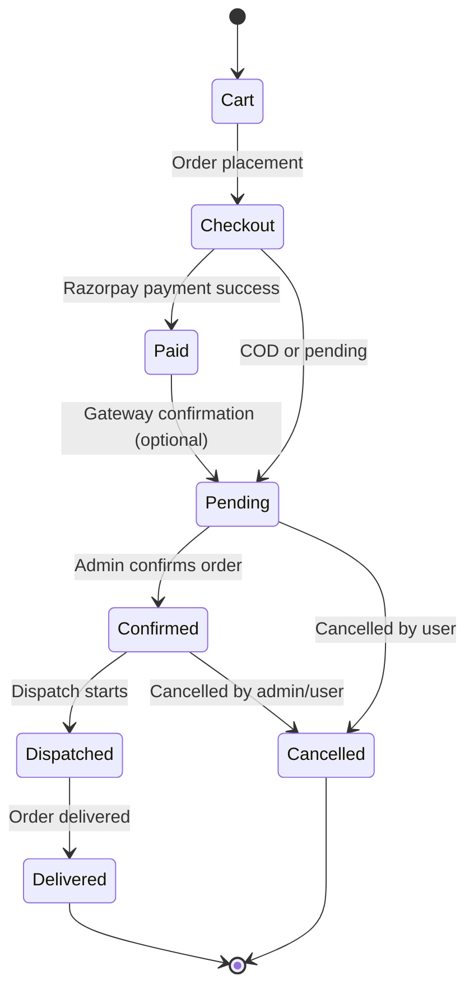

# Para-Sale

A full-stack e-commerce app built with React (Vite) + Node.js (Express) + Supabase + Razorpay.

---

## Prerequisites

Make sure the following are installed on your machine:

| Tool | Version | Install |
|------|---------|---------|
| Node.js | v18+ | https://nodejs.org |
| npm | v9+ | Comes with Node.js |
| Git | any | https://git-scm.com |

---

## Setup Instructions

### 1. Clone the repository

```bash
git clone https://github.com/prasadb18/para-sale.git
cd para-sale
```

### 2. Install server dependencies

```bash
cd server
npm install
```

### 3. Configure server environment variables

Create a `.env` file inside the `server/` folder:

```bash
# server/.env
SUPABASE_URL=your_supabase_project_url
SUPABASE_KEY=your_supabase_service_role_key
RAZORPAY_KEY_ID=your_razorpay_key_id
RAZORPAY_KEY_SECRET=your_razorpay_key_secret
RAZORPAY_WEBHOOK_SECRET=your_razorpay_webhook_secret
PORT=5000
```

> Get Supabase credentials from: https://app.supabase.com → Project Settings → API  
> Get Razorpay credentials from: https://dashboard.razorpay.com → Settings → API Keys

### 4. Set up the database

- Go to your Supabase project dashboard
- Open the **SQL Editor**
- Run the SQL file located at `server/sql/razorpay-orders.sql`

### 5. Install client dependencies

```bash
cd ../client
npm install
```

### 6. Configure client environment variables

Create a `.env` file inside the `client/` folder:

```bash
# client/.env
VITE_SUPABASE_URL=your_supabase_project_url
VITE_SUPABASE_ANON_KEY=your_supabase_anon_key
VITE_API_URL=http://localhost:5000
```

---

## Running the App (Development)

Open **two terminals**:

**Terminal 1 — Start the backend server:**
```bash
cd server
npm run dev
```
Server runs at: `http://localhost:5000`

**Terminal 2 — Start the frontend:**
```bash
cd client
npm run dev
```
Frontend runs at: `http://localhost:5173`

---

## Building for Production

From the root of the project:

```bash
npm run build
npm start
```

---

## Order State Machine


