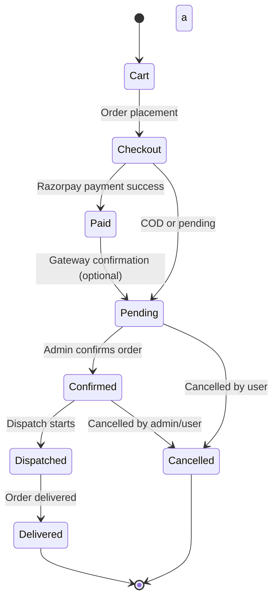

# para-sale

## Order State Machine

```mermaid
stateDiagram-v2
    [*] --> Cart
    Cart --> Checkout : Order placement
    Checkout --> Paid : Razorpay payment success
    Checkout --> Pending : COD or pending
a
    Paid --> Pending : Gateway confirmation (optional)
    Pending --> Confirmed : Admin confirms order
    Confirmed --> Dispatched : Dispatch starts
    Dispatched --> Delivered : Order delivered
    Confirmed --> Cancelled : Cancelled by admin/user
    Pending --> Cancelled : Cancelled by user
    Cancelled --> [*]
    Delivered --> [*]
```

Use this flow to connect app UI, backend order status, and analytics.
